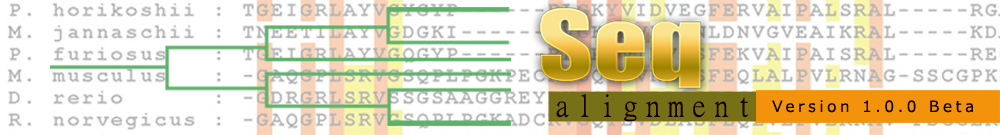

.. sidebar:: Summary

    :Release: |release|
    :Date: |today|
    :Developer: **Thaman Chand**
    :Target: Bioinformatician
    :Organization: Unversity of Turku
                   Faculty of Mathematics &
                   Natural Science

Seq-Alignment Documentation
===========================
The documentation illustrate general overview of the application covering functionalities and requirements
in details.To know how to use application its better to go through the documentation.

Contents:
=========
.. toctree::
   :maxdepth: 3

   overview
   system_requirement
   configuration
   appliwork
   testapp
   api
   runapp

Indices and tables
==================

* :ref:`genindex`
* :ref:`modindex`
* :ref:`search`
